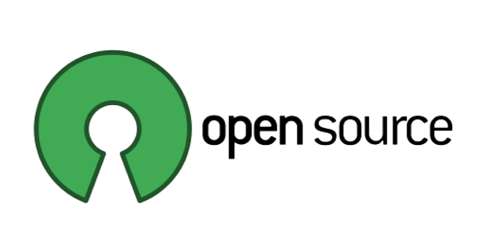

 Software engineering is the process of designing, building, and maintaining complex software systems. As a student of software engineering, I have learned a lot about the different concepts and practices that are used in the field. In this essay, I have focused on three key topics: open source software development, configuration management, and functional programming..

## Open Source Software Development

Open source software development refers to the process of creating software where the source code is freely available to be modified and distributed by anyone. This means that anyone can view, modify, and contribute to the code, which can lead to faster innovation and collaboration. As someone who has always been interested in technology and innovation, I was drawn to the idea of open source software because it allows for a more collaborative and transparent approach to software development. This means that anyone can contribute to the development of a piece of software, and that the source code is freely available for anyone to use and modify. Beyond web application development, open source software is important because it allows for more inclusive and innovative solutions, and can make technology more accessible to a wider range of users.

 

## Configuration Management

Configuration management is the process of tracking and controlling changes to software, including the versions and dependencies of the various components. This is important because it allows teams to manage the complexity of large software systems and ensure that changes to the code do not break existing functionality. Configuration management tools can help teams track and manage changes to the code, as well as automate the process of building and deploying software. Beyond web application development, configuration management is important because it allows for easier collaboration on complex projects, and can help to prevent errors and improve the overall quality of the software.

## Functional Programming

Functional programming is a programming paradigm that emphasizes the use of pure functions and immutable data. In functional programming, functions are designed to take input and produce output without modifying any state. This is different from other paradigms, like imperative programming, where functions can modify state. Beyond web application development, functional programming is important because it can make code more predictable and easier to reason about, which can make it easier for developers to write and maintain complex software.

## Towards the Future

In conclusion, these three concepts are all critical to the field of software engineering in general. Open source software development enables collaboration and customization, while configuration management helps teams manage the complexity of large software systems. Functional programming allows for more modular and reusable code, as well as improved reliability. These concepts and many others are essential for building robust, scalable, and maintainable software systems.
