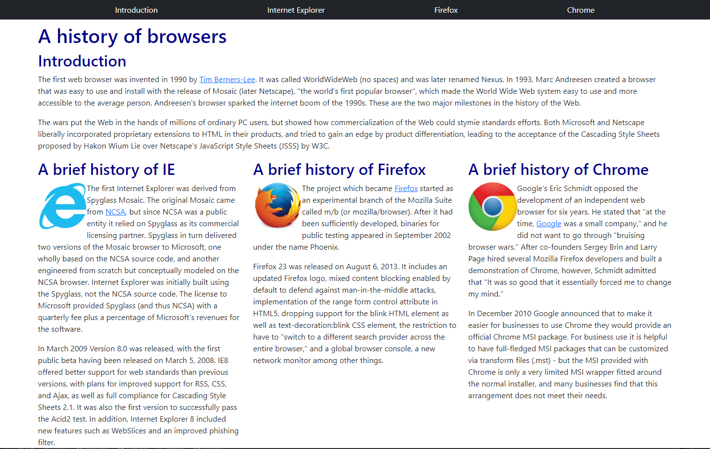

Have you ever gone through multiple web pages that look remarkably similar to one another from completely different websites? They are all using a similar UI Framework. UI Frameworks is a software tool used for building a software program such as a website to run on the internet. This can allow for many well designed websites that are proven to look pleasant already, but it also presents another set of problems as well.

## Learning to Make a Frame Work

Learning these UI Frameworks is like learning another coding language where you have to study what all these words and functions do to your website that have a chance of not working with other frameworks or HTML or CSS. Once you learn your way around the particular UI Framework then you are ensured a simpler and cleaner set of code when building your product. Again, with these frameworks you are ensured your site being presentable and pleasant which is not always guaranteed when trying to build a website from scratch with HTML or CSS.

## The Downsides

With a UI Framework that multiple companies/individuals use will lead to similar looking websites and leads to less memorability compared to building without the framework. If the creator of the framework decides to update it then there is a chance of more bugs being presented. 

## Using Bootstrap 5

After attempting to learn Bootstrap 5 over the course of a week has been really complicated because I was not all too familiar with HTML or CSS until recently, so learning those languages and the framework has been a lot to take in. Bootstrap has lead to shorter and cleaner code compared to writing in HTML or CSS. So there is an example below of a website built in both HTML and Bootstrap respectively.

Below is the HTML example:

The website image below is built using bootstrap:

## In Conclusion

UI Frameworks are important and are worth learning if you enjoy cleaner and simpler code, but understanding that it will take more work to understand said framework. Weighing the pros and cons can lead to using frameworks or just sticking with standard coding on a case by case basis. 
