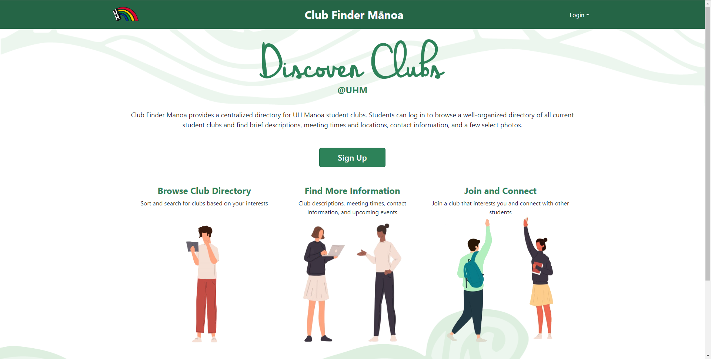

Patterns are useful in everyday life and they help us distinguish new things quickly. Have you ever tried moving over from one social media platform to another? Let's use Youtube Shorts to Tik-tok or Instagram. These are platforms that have video sharing as their main source of entertainment, they are formatted slightly differently to market themselves as a different product, but there are enough similarities that new users can feel comfortable on these websites. Features such as ways to like and follow creators and their work are very similar from platform to platform which includes how they are shared with other users on the site. Patterns allow us to feel comfortable in new experiences while feeling a sense of familiarity.

## Utilizing Design Patterns

Design Patterns are not only incredibly useful to users, but also to website designers and the creators of the website. During a recent project with designing a user friendly website for UH Manoa where you can find clubs that you would be interested in and a hub for all club information, we used design patterns to allow for our group to work on the site coherently. We used a template called bowfolios which gave us a basis for how we would work and design the website. We were not used to working together and sharing code with one another, so we had very little experience with how each individual writes their code; and that's where design patterns come in. Due to the template already having a format which works, we can base our coding in the way they are used in the template which allows us to ready and write much more efficiently than guessing what the other person is trying to write or using an obscene amount of comments.

Below is the template known as bowfolios:

The website image below is what we had created using the above template:

## In Conclusion

Design Patterns are incredibly useful and are used in a multitude of ways that allow for designers to create more flexible and ultimately more reusable designs.  
