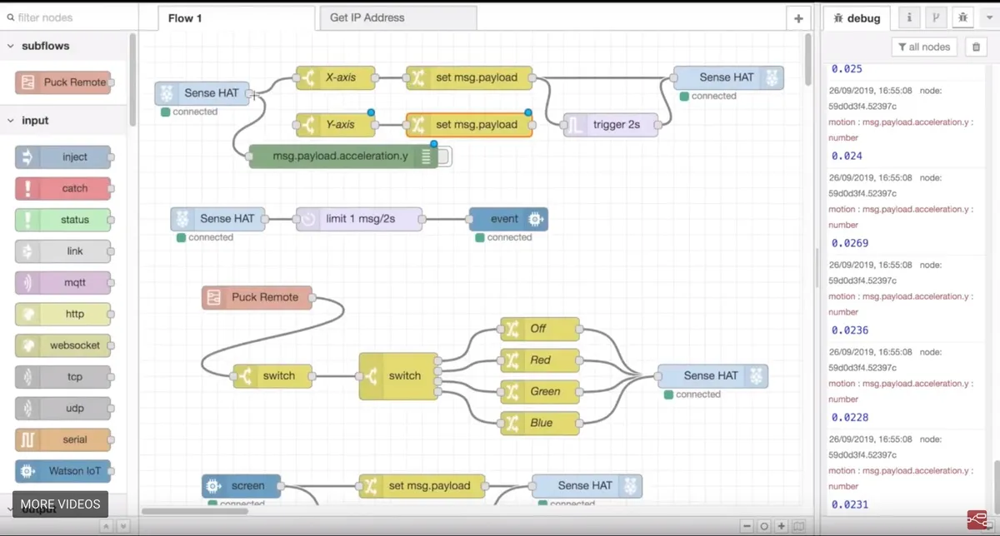

The final project of EE 368: The Internet of Things, tasked a group of us to create a product using Node-RED and Raspberry Pi (a flow-based development tool) that we are able to pitch for funding said product.

The Internet of Things is such massive topic and the potential of what we could create is seemingly endless, but we had a smaller timetable then we were supposed to be given due to some technical issues during the middle of the semester which pushed back the final project. So, the team we had devised an idea to make a surf weather station that would check for the best waves, wind, and weather somewhere on the island of Oahu and display that information on the LEDs of the Raspberry Pi. Along with this would be a more in-depth search and find beach reports based on your specifications on a desktop.

When developing in this flow based design, we had to use Javascript which none of us knew too well as the class did not require us to really delve too deep into. This had limited us on the possible final projects, but in the end it worked out fine. My part of the project require me to help program the data from an official weather station to be displayed on the Raspberry Pi. Also I was tasked with being the speaker of the group and pitch the project to the rest of the class. This helped with practicing more of my own public speaking that will be something I have to get used to if I want to continue on this career path. 
</pre>

