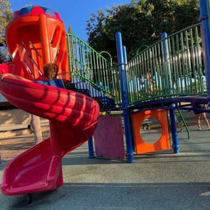

 

During my Sophmore year of highschool, my freinds and I needed to volunteer for some community service and in the end we decided to help out with a summer fun program at Kahala Community Park. I’m not going to say that this was the first idea I had when it came to community service, but I think it was one of the more valuable experiences I had during highschool. As junior leaders we were expected to be vigilant of all the children, help the group leaders at all times, and make sure the kids all had a great summer. At first we were dreading working with some of these children that ranged from those in kindergarten to 6th grade, but as the summer continued on we grew to value our time with the kids.

The groups that we were given had about 20 or more kids and they were split up based on the grade they were in. To the surprise of myself, the kids for the most part were very good and they always wanted to take part in activities while also being kind to one another. We would take the kids on excursions like going to Chuck E. Cheese or the water park which were stressful experiences because even though the kids were well behaved, they were still kids who wanted to have fun when they had the chance and we needed to stay attentive throughout the day. We even took part in events like a play that involved all of the kids and leaders for the parents of said kids.

I was in charge of the 5th graders and I think I lucked out in the end because they were old enough to understand that they could not act poorly in front of others while also being innocent enough not to be rebellious at all times. Slowly I was able to introduce myself to all the kids in my group and was able to understand who the kids were one on one which helped with leading the kids and making sure they stayed in line. I learned lessons that would work in almost any leadership role which is trying to understand where the people you are leading are coming from so you can appropriately deal with situations as they come. Being patient is a key lesson that was also learnt from this as kids do not have full control of thier emotions at that age and you need to keep composure and handle situations as calmly as possible to get the best results.

