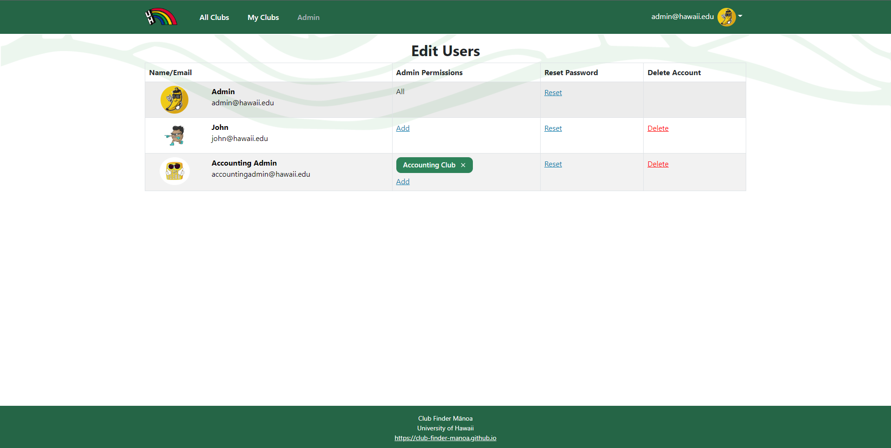

This is an ICS 314 final project that was delegated to teams of 5 with the task of creating a website that would be both related to UH and useful to the school. So the team I was on was given the task of creating a club hub where people can find new school clubs that they would want to join and information such as emails of advisors or times of meetings. Other things the website has to do is allow club advisors and admins to create new clubs or add any additional information. This project is the culmination of everything we have learned thus far in ICS 314.

For this project, I ended up helping create the organization that we would be using for project on GitHub and organizing how the start of the project would be handled. When it came to programming, I was tasked with creating and designing an admin page which would be where the admin would be allowed to give access to clubs for club advisors, reset passwords of accounts, and deleting accounts. I had ended up making the groundwork and shell of this page, but did not end up doing all of it myself which had work shared with another individual on the team. The other task that I was given was to help create and design the form that would be used in editing/adding clubs into the mongo database. Most of the work on the form had been done by team members while I had worked on the skeleton and making sure the links weren't broken to the correct pages.

This project allowed me to learn about group work over GitHub as it will probably be used in future projects. I had gotten a taste of what Issue Driven Project Management was like and how tasks would be created and delegated throughout the team. The issue board was something like a brainstorm section where individuals of the team would create branches that anyone could work on and assign themselves to their own problems.

This is a link to the project website: <a href="https://club-finder-manoa.github.io/">Project Overview</a>

